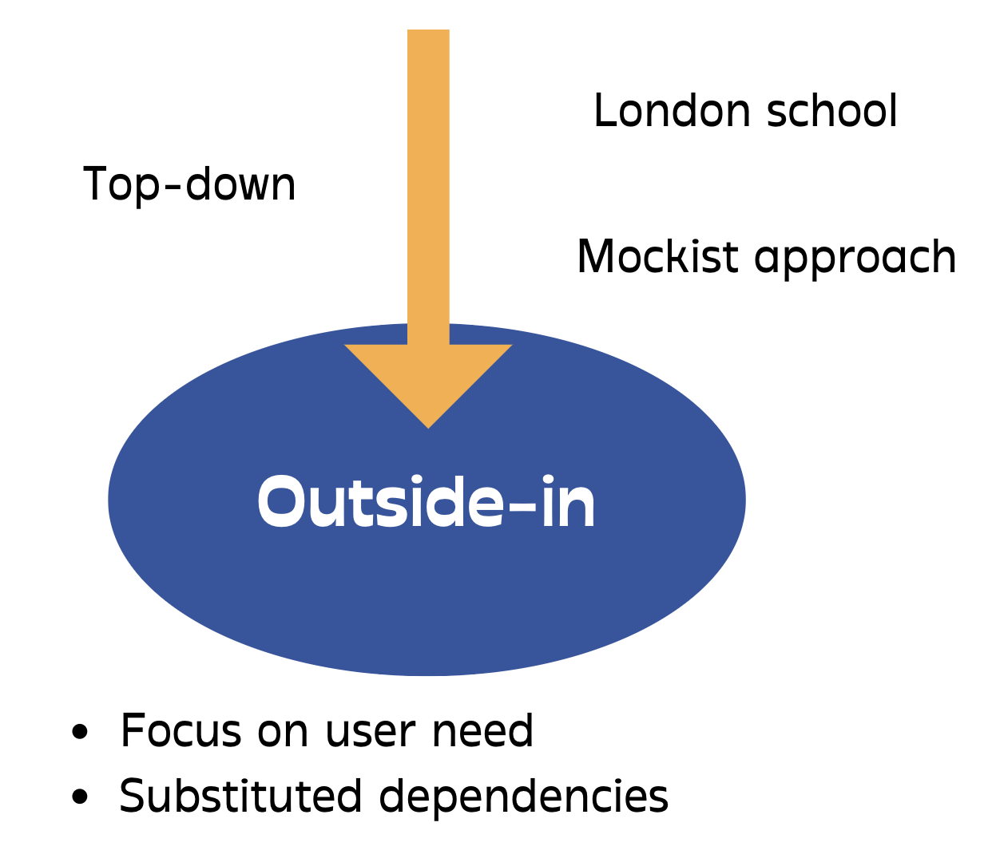

## Add an Acceptance Test
Use `Outside-In TDD` and `Clean Architecture` to finish this step.
 



### Clean Architecture


Please take some time to read about [Clean Architecture](https://xtrem-tdd.netlify.app/Flavours/clean-architecture).

### Write a failing Acceptance Test

Automate this acceptance test then use the principles above to develop what is necessary.

```gherkin
Feature: Portfolio evaluation
  Customers can evaluate their Portfolio in the 3 currencies supported by our system.

  Background:
    Given our Bank system with EUR as Pivot Currency
    And exchange rate of 1.2 defined for USD
    And exchange rate of 1344 defined for KRW

  Scenario: Evaluate in EUR
    Given an existing portfolio
    And our customer adds 5678.89 USD on their portfolio
    And our customer adds 5674567.245 KRW on their portfolio
    And our customer adds 9432 USD on their portfolio
    And our customer adds 4989.67 EUR on their portfolio
    When they evaluate their portfolio in EUR the amount should be 21804.227
```

### Reflect
In this step we have:
- used `Outside-in TDD` by writing an `Acceptance Test` in the language of our business (with `Cucumber`) and used it as a driver for our implementation 
- followed `Clean Architecture` principles (Ports / Adapters, Use Cases)
- and more...

> What do you think about it? How could you apply it on a daily basis?


### Step-by-step solution
- [java](../../java/docs/11.acceptance-tests.md)
- [C#](../../c%23/docs/11.acceptance-tests.md)
